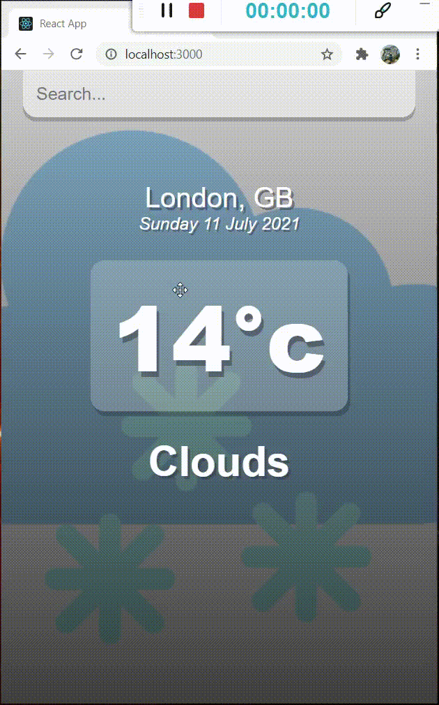

# React Weather App

This is a react application I have developed as part of my web application portfolio. I have used OpenWeather API to fetch weather data according to the searched cities.

### This application is deployed live with Heroku at:

https://weather-app-react-02.herokuapp.com

### Screenshot

### References

https://reactjs.org/docs/getting-started.html

https://www.udemy.com/course/react-the-complete-guide-incl-redux/

https://youtu.be/GuA0_Z1llYU

Icons made by <a href="https://www.flaticon.com/authors/iconixar" title="iconixar">iconixar</a> from <a href="https://www.flaticon.com/" title="Flaticon">www.flaticon.com</a>

